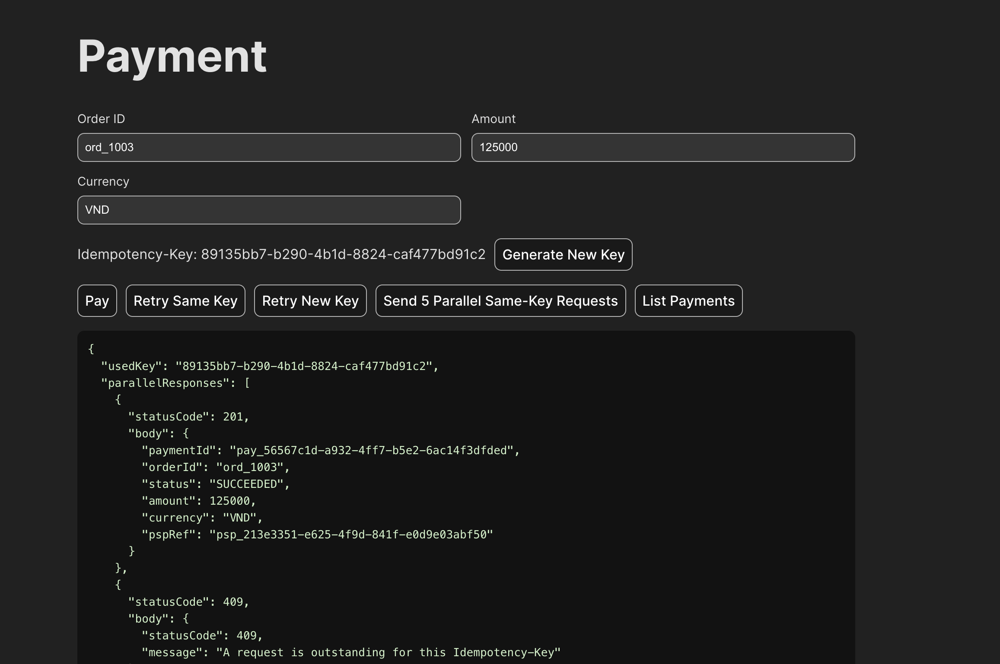
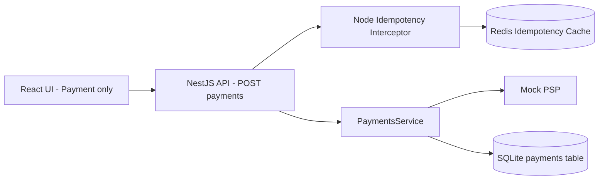
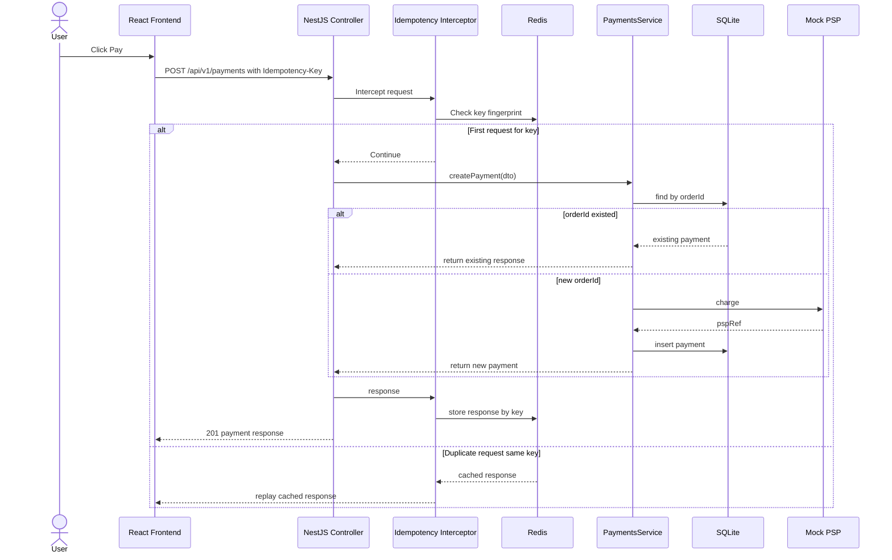

# Payment idempotency

## UI

## Architecture

```mermaid
flowchart LR
    UI[React UI - Payment only] --> API[NestJS API - POST payments]
    API --> IDEM[Node Idempotency Interceptor]
    IDEM --> REDIS[(Redis Idempotency Cache)]
    API --> SVC[PaymentsService]
    SVC --> PSP[Mock PSP]
    SVC --> DB[(SQLite payments table)]
```

## Sequence

```mermaid
sequenceDiagram
    actor U as User
    participant F as React Frontend
    participant A as NestJS Controller
    participant I as Idempotency Interceptor
    participant R as Redis
    participant S as PaymentsService
    participant D as SQLite
    participant P as Mock PSP

    U->>F: Click Pay
    F->>A: POST /api/v1/payments with Idempotency-Key
    A->>I: Intercept request
    I->>R: Check key fingerprint

    alt First request for key
      I-->>A: Continue
      A->>S: createPayment(dto)
      S->>D: find by orderId
      alt orderId existed
        D-->>S: existing payment
        S-->>A: return existing response
      else new orderId
        S->>P: charge
        P-->>S: pspRef
        S->>D: insert payment
        S-->>A: return new payment
      end
      A->>I: response
      I->>R: store response by key
      A-->>F: 201 payment response
    else Duplicate request same key
      R-->>I: cached response
      I-->>F: replay cached response
    end
```
